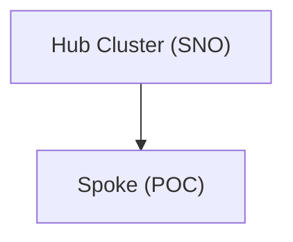

# Fleet Management

For fleet management, we recommend starting with a Single Node OpenShift (SNO) installation as the hub cluster, then installing Red Hat Advanced Cluster Management (ACM) to manage your cluster fleet at scale.

## Process Overview

1. Complete all [prerequisites](../prerequisites/index.md)
2. Set up the [installation host](../prerequisites/installation-host.md)
3. Install the [SNO hub cluster](sno-hub.md)
4. Install [storage on the hub](hub-storage.md)
5. Install [Advanced Cluster Management](acm.md)
6. Use ACM to provision and manage spoke clusters

## Architecture

## Hardware Requirements

- Single box for the hub. Recommend 24 cores, 64 GB RAM and two disks — OS disk 120 GB, data disk 2 TB
- Can be bare metal or virtualized. No OpenShift Virtualization on the hub.

## Why Fleet Management?

| Benefit               | Description                                                         |
| --------------------- | ------------------------------------------------------------------- |
| Centralized control   | Manage all clusters from a single pane of glass                     |
| Consistent policy     | Enforce governance and security policies across the fleet           |
| Scalable provisioning | Create new clusters on demand through ACM                           |
| Lifecycle management  | Upgrade and maintain clusters centrally                             |
| Observability         | Unified view of cluster health and compliance                       |
