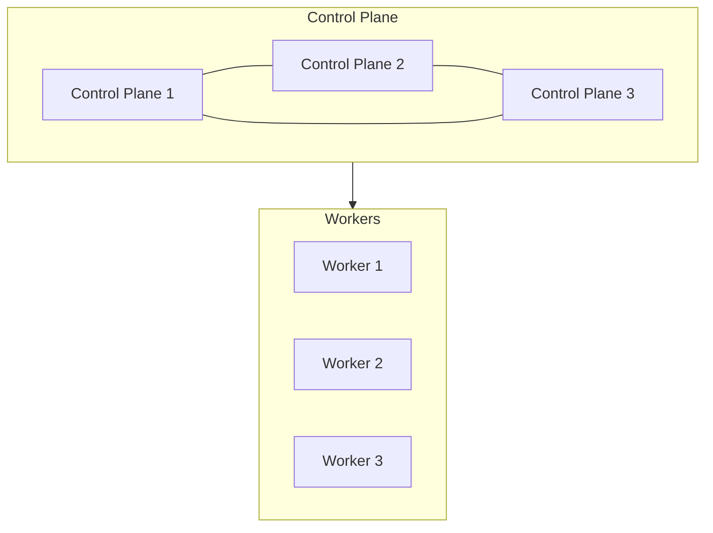
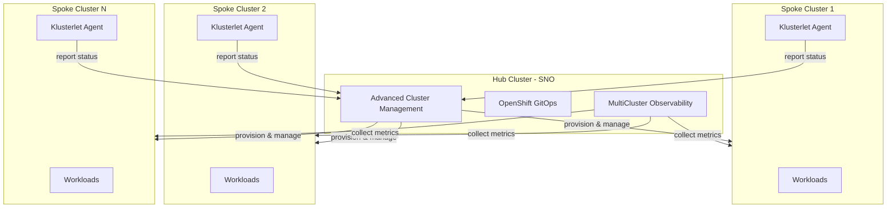

# Architecture

## OpenShift Cluster Architecture

An OpenShift cluster consists of two types of nodes working together:

**Control Plane Nodes** (minimum 3 for high availability)

- Run the Kubernetes API server, etcd, scheduler, and controller manager
- Manage cluster state, scheduling decisions, and API requests
- Should not run general workloads in production (but are schedulable in compact 3-node clusters)

**Worker Nodes** (minimum 3 recommended)

- Run application workloads (containers and virtual machines)
- Host the OpenShift SDN (OVN-Kubernetes) for pod networking
- Scale horizontally to increase cluster capacity

### Key Components

| Component          | Runs On       | Purpose                                                  |
| ------------------ | ------------- | -------------------------------------------------------- |
| API Server         | Control Plane | REST API for all cluster operations                      |
| etcd               | Control Plane | Distributed key-value store for cluster state            |
| Scheduler          | Control Plane | Assigns pods to nodes based on resource availability     |
| Controller Manager | Control Plane | Runs controllers that regulate cluster state             |
| Kubelet            | All Nodes     | Agent that ensures containers are running on each node   |
| OVN-Kubernetes     | All Nodes     | Software-defined networking for pod communication        |
| CRI-O              | All Nodes     | Container runtime                                        |
| Machine Config Operator | Control Plane | Manages node OS configuration via MachineConfig CRs |

### Networking

OpenShift uses three distinct networks:

| Network         | Default CIDR  | Purpose                                        |
| --------------- | ------------- | ---------------------------------------------- |
| Machine Network | 10.0.0.0/28   | Physical node communication                    |
| Pod Network     | 10.128.0.0/14 | Internal pod-to-pod communication (overlay)    |
| Service Network | 172.30.0.0/16 | Kubernetes service ClusterIPs                  |

External traffic enters the cluster through the Ingress VIP, which routes to the OpenShift Router (HAProxy) running on worker nodes. The API VIP provides access to the Kubernetes API on port 6443.

### Storage

OpenShift separates storage concerns:

- **etcd** — Local NVMe/SSD on control plane nodes (low latency required)
- **Persistent Volumes** — Provided by a CSI driver from your storage vendor
- **Ephemeral storage** — Node-local for container scratch space

## Fleet Management Architecture (Hub and Spoke)

For organizations managing multiple clusters, the hub and spoke model centralizes operations:

### Hub Cluster

The hub is a Single Node OpenShift (SNO) installation that runs the management plane:

- **Red Hat Advanced Cluster Management (ACM)** — Provisions, upgrades, and manages the lifecycle of spoke clusters
- **OpenShift GitOps (ArgoCD)** — Pushes configuration and applications to spoke clusters via Git
- **MultiCluster Observability** — Aggregates metrics and health data from all spoke clusters

The hub does not run production workloads. It is purely a management and observability platform.

### Spoke Clusters

Spoke clusters are the production environments where workloads run:

- Provisioned automatically by ACM via bare metal BMC integration
- Report health and compliance status back to the hub via a Klusterlet agent
- Receive policy, configuration, and application deployments from the hub
- Operate independently if connectivity to the hub is temporarily lost

### Benefits

| Benefit                | Description                                                         |
| ---------------------- | ------------------------------------------------------------------- |
| Centralized control    | Single pane of glass for all cluster operations                     |
| Consistent policy      | Enforce governance, security, and compliance across the fleet       |
| Automated provisioning | Create new bare metal clusters on demand through ACM                |
| Lifecycle management   | Upgrade and patch clusters centrally with controlled rollout        |
| Observability          | Unified view of cluster health, metrics, and alerts                 |
| GitOps at scale        | Push application and configuration changes across all clusters      |
| Resilient spokes       | Spoke clusters continue operating if hub connectivity is interrupted |
